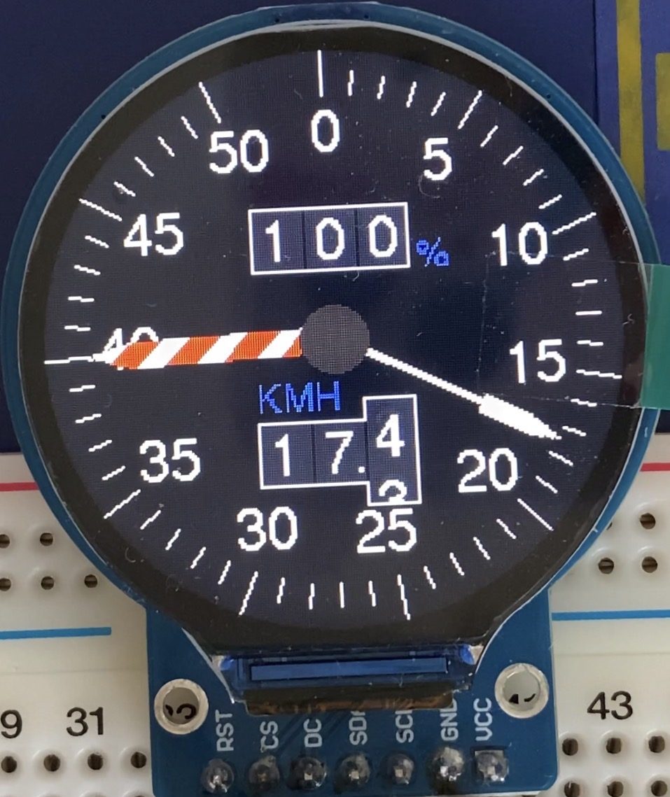

# PoC（技術実証）
1. 差圧センサによる流速測定の実現性検証
    - SDP810_500Paを用いた微差圧計測とベルヌーイの定理による流速変換
    - I2C通信の安定性確認
2. 円形IPSディスプレイの駆動検証
    - ESP32-C3とGC9A01間のSPI通信の安定性確認
    - アナログメーター風UIの描画パフォーマンス確認

3. リチウムイオンバッテリーの運用検証
    - XIAO-ESP32-C3内蔵のバッテリー充電回路の活用
    - 分圧抵抗によるバッテリー電圧監視と残量推定
    - 省電力運用フローの設計

# 開発環境
## バージョン情報
- Arduino IDE: 2.3.7
- ESP32 by Espressif Systems: 2.0.17（3.x系は，LovyanGFXがまだ対応していない可能性が高い．）
- Sensirion Core by Sensirion: 0.7.2
- Sensirion I2C SDP by Sensirion: 0.1.0
- LovyanGFX by lovyan03: 1.2.19

## 注意
- ESP32C3のパーティション設定を変更して，フラッシュメモリのプログラム領域APPを増やしています．（Arduino IDE > Tools > Partition Scheme > "Huge APP (3MB No OTA/1MB SPIFFS)"）
